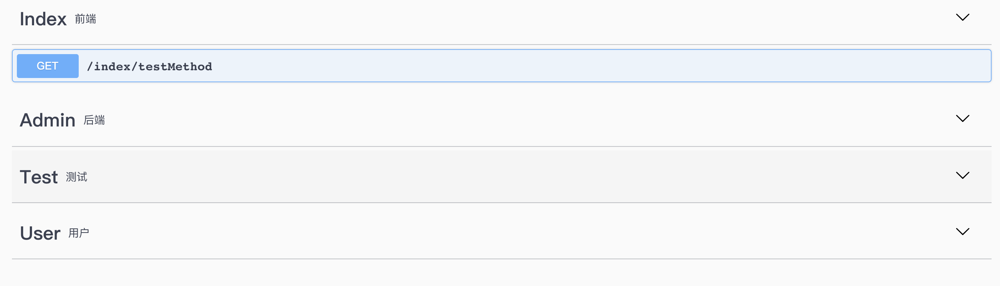
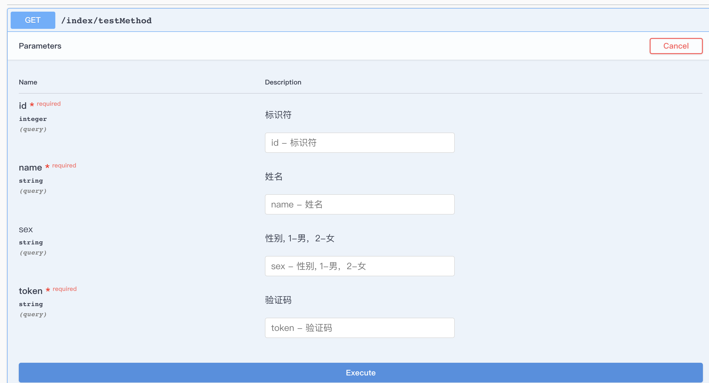

<h1 align="center"> swagger </h1>

<p align="center"> 专门为 ThinkPhp5 生成Api文档，基于 Swagger.</p>


## Installing

```shell
$ composer require tien/swagger --dev
```

## Usage

### 该扩展仅支持 ThinkPhp5 框架使用。目前只提供了生成两种注释，一个是方法体的注释，另外一个是标签（Tag）的注释；而方法体只支持 GET 和 POST 两个请求方式。 
### 注意：只能在调试环境下使用，正式环境不会生效。而支持 swagger-php 的版本为 2.0 以上， 3.0 以下。支持 PHP7 及以上版本。
### 默认注释生成的文件在 'application/swagger/'下
## 需要将安装包 ui 文件下的 dist 目录移动到 public 目录下

### 生成方法体注释(需要与验证类结合使用)：
	
	namespace app\index\controller;
	
	use think\Controller;
	use Tien\Swagger\traits\Tien;
	
	class Index extends Controller
	{
		//一定要引入Tien
		use Tien;
		
		public function __construct()
		{
			$this->tienInit();
		}
		
		//测试生成方法体注释
		public function testMethod()
		{
			//1、直接创建, 默认 get 请求
			$this->tienMethod()->create();
			
			//1.1 若是 post 请求
			$this->tienMethod()->post()->create();
			
			//2、加入方法的简介及详细说明
			$this->tienMethod()->summary('简介')->description('详细说明')->create();
			
			//3、当该方法的 api 文档存在时，下次执行该方法时将不会再生成文档，若需要更新文档
			$this->tienMethod()->isForced()->create();
			
			//4、也可以直接更新
			$this->tienMethod()->update();
			
		}
	}
#### 验证类实现如下,验证类要求在相同模块目录下
	namespace app\index\validate;
	
	use think\Validate;
	
	class Index extends Validate
	{
	
		//特殊 api 文档参数，如权限验证 token 字段可能每个接口或每个类下的接口都会出现，
		public $specialApiParam = [
			'token' => ['string', '验证码', true],
		];
	
		//这个是验证参数
		public $testMethod = [
			'id'    => 'require|integer|gt:0',
        	'name'  => 'require|min:2|max:15',
        	'sex'   => 'in:1,2'
		];
		
		/**
		 * 这个是生成方法体注释必须要的
		 * 注意命名规范是 action 名 + ‘Msg’
		 * 修辞为 public
		 * 'id' => ['integer', '标识符', true], 'integer' 表示 id 的类型，
		 * ‘标识符’是 id 的中文名，true 表示 id 是必须的
		 */
		public $testMethodMsg = [
			'id'    => ['integer', '标识符', true],
        	'name'  => ['string', '姓名', true],
        	'sex'   => ['string', '性别, 1-男，2-女']
		];
		
		public $testMethodText = [
			'summary' => 'summary',
			'description' => '*******',
		];
	}
	
### 生成标签注释
	class Index extends Controller
	{
		use Tien;
		
		//可以一次性生成项目所有需要的标签
		public function testTag()
		{
			$tagParam = [
				['index' => '前端'],
            	['admin' => '后端'],
            	['test'  => '测试'],
            	['user'  => '用户'],
			];
			//1、直接生成
			$this->tienTag()->setContent($tagParam)->create();
			
			//2、强制生成
			$this->tienTag()->setContent($tagParam)->isForced()->create();
			
			//3、更新
			$this->tienTag()->setContent($tagParam)->update();
		}
	}
	
### 生成 api 文档说明
	public function testSummary()
    {
        echo $this->tienSummary()->host('127.0.0.1:8000')->version('V0.1')
            ->title("test's system")->description('hello world test system')
            ->create();
    }

### 在中间件中使用，生成注释
	class TestTienMiddleware
	{
    	use TienMiddleware;

    	public function handle($request, \Closure $next)
    	{
        	$this->tienHandle($request);
        	return $next($request);
    	}
	}

### 最后在项目的根目录下运行：
```shell
$ php vendor/zircote/swagger-php/bin/swagger ./application/ -o public/dist/swagger.json
```
	
### 效果如下




### 在验证类的 $testMethodMsg 其实还可以用于错误信息的友好提示
#### 首先需要在验证类引入 TienValidate， 如下所示：
	class Index extends Validate
	{
		//引入 TienValidate
		use TienValidate;
	}
#### 然后在控制器中直接使用
	public function testMethod()
	{
		//先生成api文档，然后再验证
		$this->tienMethod()->create();
		
		//验证
		$param = $this->request->param();
       if (!$this->validate->check($param)) {
           var_dump($this->handleErrorMsg($this->validate->getError())); //比如 id(标识符)必须大于0
           var_dump($this->validate->getError()); // id必须大于0
       }
		
	}
## Contributing

You can contribute in one of three ways:

1. File bug reports using the [issue tracker](https://github.com/tien/swagger/issues).
2. Answer questions or fix bugs on the [issue tracker](https://github.com/tien/swagger/issues).
3. Contribute new features or update the wiki.

_The code contribution process is not very formal. You just need to make sure that you follow the PSR-0, PSR-1, and PSR-2 coding guidelines._

## Another
_该 Demo 只是为了学习，若有侵权或不妥之处，请联系 913346548@qq.com, 我会及时处理，谢谢！_

## License

MIT