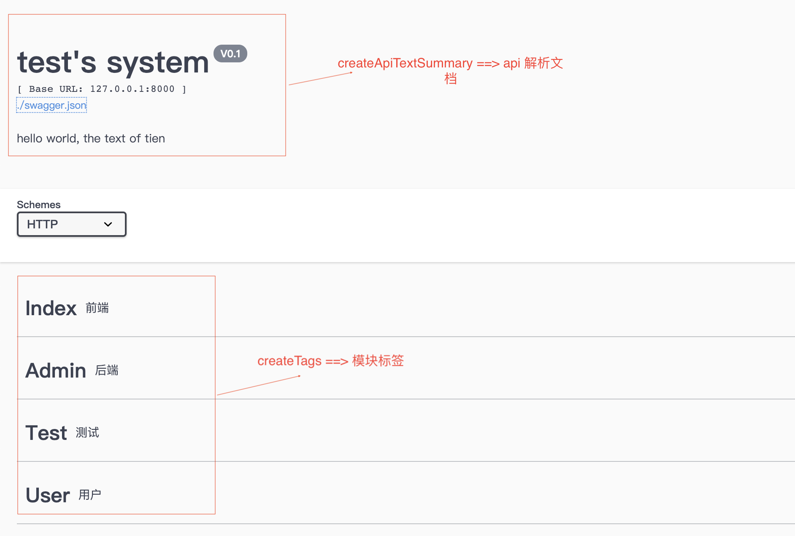
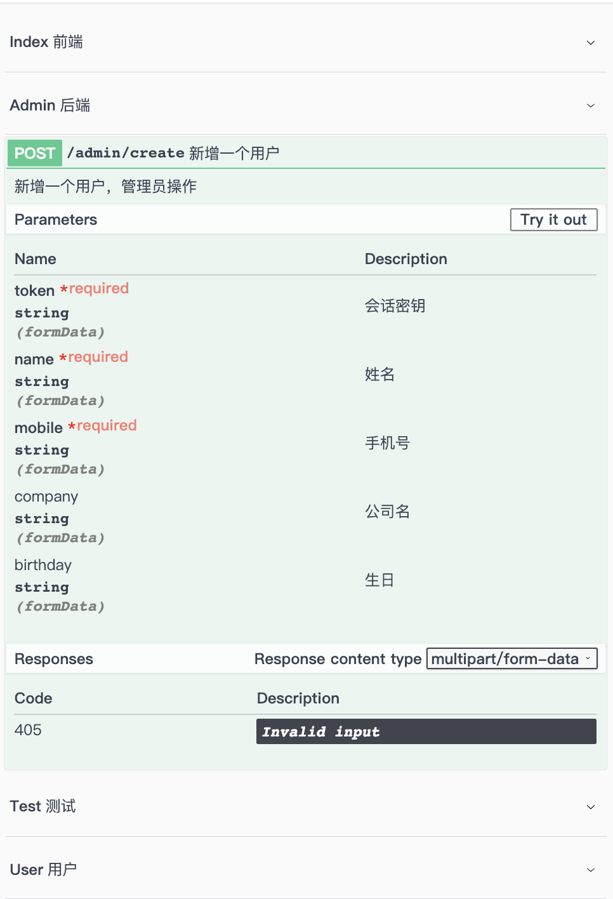
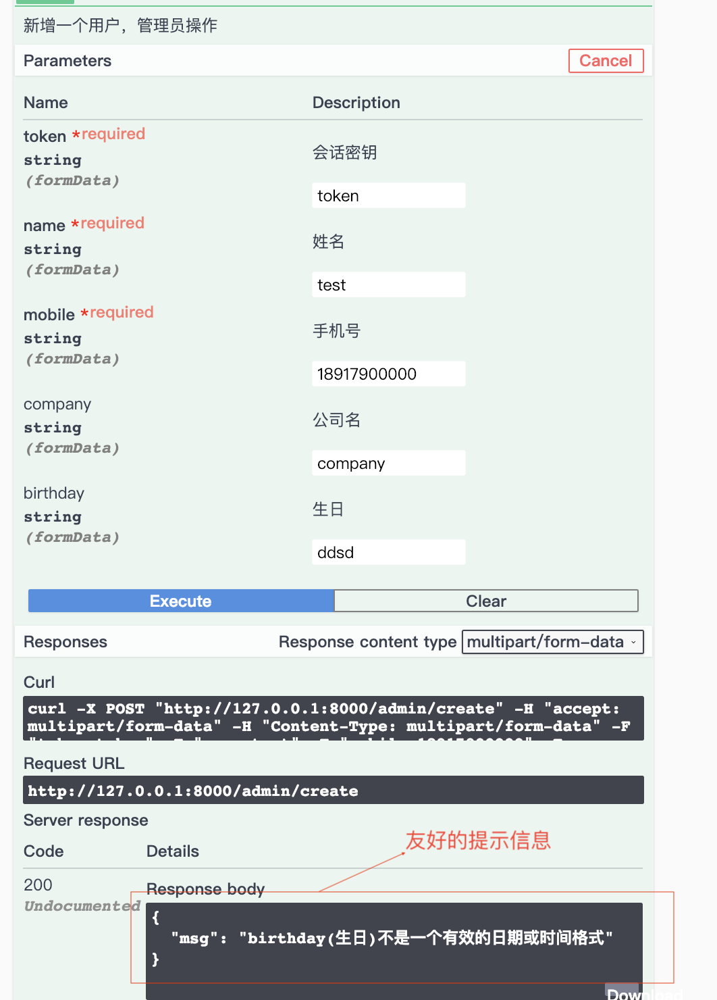
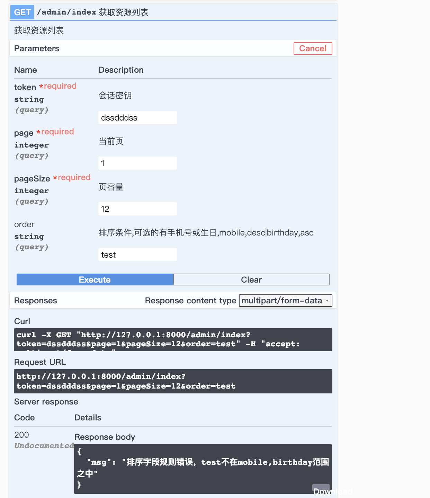
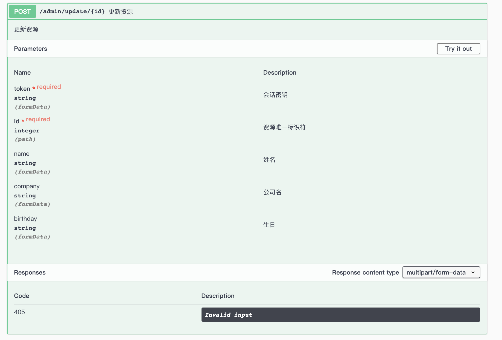

<h1 align="center"> swagger </h1>

<p align="center"> 专门为 ThinkPhp5 生成Api文档，基于 Swagger.</p>

## Installing

```shell
$ composer require tien/swagger --dev
```

## Usage

### 该扩展仅支持 ThinkPhp5 框架使用。
### 注意：生成 api 文档只能在调试环境下使用，正式环境不会生效。而支持 swagger-php 的版本为 2.0 以上， 3.0 以下。支持 PHP7 及以上版本。只支持四种请求方法：GET、POST、DELETE 和 PUT.
### 默认注释生成的文件在 'application/swagger/'下。
### 题外话：写这个是个人对代码有强迫症，看不习惯控制器里绝大部分是 swagger 注释，也想过拎出来放单独一个页面的，但又觉得写起来很烦（太多重复的代码了），那就干脆自动生成吧。

## 需要将安装包 ui 文件下的 dist 目录移动到 public 目录下；调用相应的方法后，需要在项目的根目录下运行如下命令一(下文将用‘命名一’表示该命令)，然后可在 http://127.0.0.01:8000/dist/index.html 下查看效果：
```shell
$ php vendor/zircote/swagger-php/bin/swagger ./application/ -o public/dist/swagger.json
```
### 生成 api 文档注释，及模块标签
	namespace app\index\controller;
	
	use think\App;
	use think\Controller;
	use Tien\Swagger\traits\Tien;

	class Index extends Controller
	{
    	//一定要引入Tien
    	use Tien;

		public function __construct(App $app = null)
	    {
	        parent::__construct($app);
	        $filePath = '';         //生成文档存放的路径，默认 application/swagger 目录下
	        $isThrow  = false;       //若相应的验证类不存在是否抛出错误，默认抛出，可以再不需要生成文档的控制器使用
	        $this->tienInit($filePath, $isThrow);
	    }
	
	    /**
	     * :生成 api 解析文档
	     *
	     */
	    public function createApiTextSummary()
	    {
	        echo $this->tienSummary()->host('127.0.0.1:8000')->version('V0.1')
	            ->title("test's system")->description('hello world, the text of tien')
	            ->create();
	    }
	
	    /**
	     * :生成 api 文档的模块标签，有三种方法，使用示情况而定
	     *
	     * @throws \Tien\Swagger\exceptions\FileException
	     */
	    public function createTags()
	    {
	        $tagParams = [
	            ['index' => '前端'],
	            ['admin' => '后端'],
	            ['test'  => '测试'],
	            ['user'  => '用户'],
	        ];
	        //1、直接生成
	        $this->tienTag()->setContent($tagParams)->create();
	
	        //2、强制生成
	        $this->tienTag()->setContent($tagParams)->isForced()->create();
	
	        //3、更新
	        $this->tienTag()->setContent($tagParams)->update();
	    }
    }
### 效果如下图所示：
 
 
### 生成方法体注释，有两种方法，第一是通过中间件，简单方便，代码也会更简洁。第二种方法是直接在控制器调用相应的方法，用于特殊情形。两种方法都需要与验证类结合使用，该验证类要求是与控制器处于同一模块下，且类名与控制器名是一样的(注意观察验证类下属性的命名特征)。

### 先看验证类，假设是为了 admin 模块下的 index 控制器里的  create 方法生成注释体。
#### admin 模块 index 验证类
	namespace app\admin\validate;

	use think\Validate;
	
	class Index extends Validate
	{
	    /**
	     * 特殊字段，可能每个 api 接口都需要的
	     *
	     * @var array
	     */
	    public $specialApiParam = [
	        'token' => ['string', '会话密钥', true],
	    ];
	
	    /**create start***/
	    
	    /**
	     * 验证规则
	     */
	    public $create = [
	        'name'      => 'require|min:2|max:16',
	        'mobile'    => 'require|length:11',
	        'company'   => 'min:2|max:50',
	        'birthday'  => 'date',
	    ];
	
	    /**
	     * 第一个元素是类型，第二个是中文解释，第三个可以为空或 false，表示不是必须的
	     *
	     * @var array
	     */
	    public $createMsg = [
	        'name'      => ['string', '姓名', true],
	        'mobile'    => ['string', '手机号', true],
	        'company'   => ['string', '公司名'],
	        'birthday'  => ['string', '生日']
	    ];
	
	    //接口文字注释
	    public $createText = [
	        'description'   => '新增一个用户，管理员操作',
	        'summary'       => '新增一个用户'
	    ];
	
	    /**create end***/
	
	}
	
### 第一种方法生成方法体注释：通过中间件
#### 中间件内容如下：
	namespace app\http\middleware;

	use Tien\Swagger\traits\TienSwaggerMiddle;
	
	class CreateApiText
	{
	    //引入 TienSwaggerMiddle，用于中间件
	    use TienSwaggerMiddle;
	
	    public function handle($request, \Closure $next)
	    {
	        $this->tienHandle($request, '', false);
	        return $next($request);
	    }
	}
#### 然后在应用目录 application 下的 middleware.php 文件加入该中间件

	return [
	    \app\http\middleware\CreateApiText::class,      //生成 api 文档
	    //其他中间件
	];
#### 假设路由定义如下：
	Route::post('admin/create', 'admin/index/create');
#### 然后调用 admin/index/create 方法。再执行命令一，最后效果如图所示：


### 第二种方法是在控制器中方法调用相应的方法。
	namespace app\index\controller;
	
	use think\Controller;
	use Tien\Swagger\traits\Tien;
	
	class Index extends Controller
	{
		//一定要引入Tien
		use Tien;
		
		public function __construct()
		{
			$this->tienInit();
		}
		
		//测试生成方法体注释
		public function testMethod()
		{
			//1、直接创建, 默认 get 请求
			$this->tienMethod()->create();
			
			//1.1 若是 post 请求
			$this->tienMethod()->post()->create();
			
			//2、加入方法的简介及详细说明
			$this->tienMethod()->summary('简介')->description('详细说明')->create();
			
			//3、当该方法的 api 文档存在时，下次执行该方法时将不会再生成文档，若需要更新文档
			$this->tienMethod()->isForced()->create();
			
			//4、也可以直接更新
			$this->tienMethod()->update();
			
		}
	}

### 在验证类的 createMsg 其实还可以用于验证错误信息的友好提示。请求参数的验证强烈建议用前置中间件完成，不应该放在控制器去完成，因为在进入控制器之前可能会调用其他的前置中间件。
#### 首先需要在验证类引入 TienValidate， 如下所示：
	class Admin extends Validate
	{
		//引入 TienValidate
		use TienValidate;
	}
#### 验证类中间件内容如下：
	use Tien\Swagger\traits\TienValidateMiddle;

	class ValidateParams
	{
	    //引入
	    use TienValidateMiddle;
	
	    public function handle($request, \Closure $next)
	    {
	        //请求的数据
	        $param = array_merge($request->param() ?? [], $request->file() ?? []);
	        
	        //验证数据
	        if (!$this->tienCheck($request, $param, false)) {
	            return json(['msg' => $this->errorMsg]);
	        }
	        
	        return $next($request);
	    }
	}
#### 加入 middleware.php
	return [
	    \app\http\middleware\CreateApiText::class,      //生成 api 文档
	    \app\http\middleware\ValidateParams::class,     //验证请求参数
	    //其他中间件
	];
#### 效果如下：


#### 当然也支持在在控制器中直接使用（一定要引入 Tien，及初始化 Tien）
	public function testMethod()
	{
		//先生成api文档，然后再验证
		$this->tienMethod()->create();
		
		//验证
		$param = $this->request->param();
       if (!$this->validate->check($param)) {
           var_dump($this->handleError($this->validate->getError())); //比如 id(标识符)必须大于0
           var_dump($this->validate->getError()); // id必须大于0
       }
		
	}
### 最后也在这里写一下个人使用的一些小的心得。在完成一个资源列表接口时，肯定会遇到排序的问题，有的时候还是根据不同的属性进行升序或降序，我是如下处理的。
#### 在验证类中是这样的，还是以 admin 模块下的 index 验证类举例(一定要引入TienValidate)：

	public $index = [
        'page'      => 'require|gt:0',
        'pageSize'  => 'require|gt:0',
        'order'     => 'order:mobile,birthday',    //排序验证规则
    ];

    public $indexMsg = [
        'page'      => ['integer', '当前页', true],
        'pageSize'  => ['integer', '页容量', true],
        'order'     => ['string', '排序条件,可选的有手机号或生日,mobile,desc|birthday,asc' ] //若排序条件省约不写，默认是降序
    ];

    public $indexText = [
        'description'   => '获取资源列表',
        'summary'       => '获取资源列表',
    ];
#### 在路由文件中加入：
	Route::get('admin/index', 'admin/index/index');
#### 效果如下:

#### 然后就是取出 order 条件了，当需要在控制器或逻辑类中应用时，引入 TienTools 类，可以很方便的获取，如下所示:
	...
	use TienTools;
	...
	
	public function index(Request $request)
    {
        //获取排序条件，若请求参数中没有，那么得到的是一个空数组
        $param = $request->param();
        $order = $this->getOrder($param, function ($key) {
            return $key;	//这个匿名函数是为了方便格式化键值，比如有的排序条件是 createTime,而数据库的字段是 create_time。那么就是在这里应用封装好的函数方法。
        });
        var_dump($order);	// 假如请求参数中 order 填写的是 "mobile,desc|birthday,asc", 那么输出的应该是 ['mobile' => 'desc', 'birthday' => 'asc']。这样就能更加方便的调用了
	  
    }
### 还有一个遇到的问题是，有的资源在更新时，有些属性是不允许更新的。这个问题的处理方法有很多中，而我的处理方法是直接在请求参数验证时直接排除，如下所示：
	//验证类代码实现
	...
	use TienValidate;
	...
	public $update = [
        'id'        => 'require|gt:0',
        'name'      => 'min:2|max:16',
        'mobile'    => 'forbidden',     //表示手机号不允许被修改
        'company'   => 'min:2|max:50',
        'birthday'  => 'date',
    ];
    public $updateMsg = [
    	...
    ];
    public $updateText = [
    	...
    ];
    ...
#### 路由文件中加入：
 	Route::post('admin/update/:id', 'admin/index/update');
#### 效果如下：

#### 若请求是这样的
	127.0.0.1:8000/admin/update/12?mobile=18917000000
	//那么提示提示信息如下：
	{"msg":"18917000000(mobile):该字段是禁止存在的"}
## Contributing

You can contribute in one of three ways:

1. File bug reports using the [issue tracker](https://github.com/tien/swagger/issues).
2. Answer questions or fix bugs on the [issue tracker](https://github.com/tien/swagger/issues).
3. Contribute new features or update the wiki.

_The code contribution process is not very formal. You just need to make sure that you follow the PSR-0, PSR-1, and PSR-2 coding guidelines._

## Another
_该 Demo 只是为了学习，若有侵权或不妥之处，请联系 913346548@qq.com, 我会及时处理，谢谢！
若各位同学有好的建议或见解，也请您能不吝赐教。
如果同学们觉得这个能给你带来一点点帮助，千万记得 star 哈，那将是给我最大的鼓励！谢谢！！_

## License

MIT